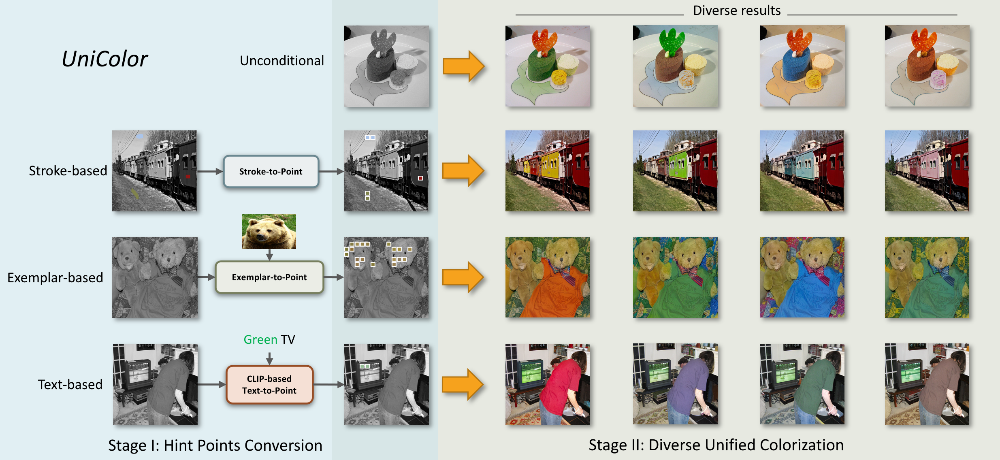

## Code release progress:

<strong>Todo:</strong>
- <strong>Instructions for training code</strong>
- <strong>Pretrained model checkpoint</strong>
- <strong>Sampling code</strong>
- <strong>Interactive interface</strong>

Done:
- Basic training code
- Environment

# *UniColor* : A Unified Framework for Multi-Modal Colorization with Transformer

SIGGRAPH Asia 2022 Paper  

[Project page](https://luckyhzt.github.io/unicolor) | [arXiv](https://arxiv.org/abs/2209.11223) | [BibTex](#bibtex)


Zhitong Huang $^{1*}$, [Nanxuan Zhao](http://nxzhao.com/) $^{2*}$, [Jing Liao](https://liaojing.github.io/html/) $^{1\dagger}$

<font size="1"> $^1$: City University of Hong Kong, Hong Kong SAR, China &nbsp;&nbsp; $^2$: University of Bath, Bath, United Kingdom </font> \
<font size="1"> $^*$: Both authors contributed equally to this research &nbsp;&nbsp; $^\dagger$: Corresponding author </font>

## Abstract:
We propose the first unified framework <em>UniColor</em> to support colorization in multiple modalities, including both unconditional and conditional ones, such as stroke, exemplar, text, and even a mix of them. Rather than learning a separate model for each type of condition, we introduce a two-stage colorization framework for incorporating various conditions into a single model. In the first stage, multi-modal conditions are converted into a common representation of hint points. Particularly, we propose a novel CLIP-based method to convert the text to hint points. In the second stage, we propose a Transformer-based network composed of <em>Chroma-VQGAN</em> and <em>Hybrid-Transformer</em> to generate diverse and high-quality colorization results conditioned on hint points. Both qualitative and quantitative comparisons demonstrate that our method outperforms state-of-the-art methods in every control modality and further enables multi-modal colorization that was not feasible before. Moreover, we design an interactive interface showing the effectiveness of our unified framework in practical usage, including automatic colorization, hybrid-control colorization, local recolorization, and iterative color editing.

### Two-stage Method:
Our framework consists of two stages. In the first stage, all different conditions (stroke, exemplar, and text) are converted to a common form of hint points. In the second stage, diverse results are generated automatically either from scratch or based on the condition of hint points.


## Environments
For basic colorization framework:
```
$ conda env create -f environment.yaml
$ conda activate unicolor
```

To use exemplar-based colorization, download the [pretrained models](https://github.com/zhangmozhe/Deep-Exemplar-based-Video-Colorization/releases/download/v1.0/colorization_checkpoint.zip) from [Deep-Exemplar-based-Video-Colorization](https://github.com/zhangmozhe/Deep-Exemplar-based-Video-Colorization), unzip the file and place the files into the corresponding folders:
- `video_moredata_l1` under the `sample/ImageMatch/checkpoints` folder
- `vgg19_conv.pth` and `vgg19_gray.pth` under the `sample/ImageMatch/data` folder

## BibTex
```
@misc{huang2022unicolor
      author = {Huang, Zhitong and Zhao, Nanxuan and Liao, Jing},
      title = {UniColor: A Unified Framework for Multi-Modal Colorization with Transformer},
      year = {2022},
      eprint = {2209.11223},
      archivePrefix = {arXiv},
      primaryClass = {cs.CV}
}
```
